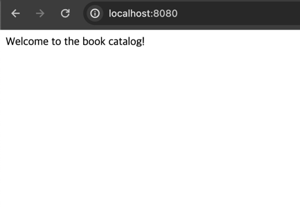

# 2. 클라우드 네이티브 패턴 및 기술
> **이 장의 주요 내용**
> - 클라우드 네이티브 애플리케이션을 위한 개발 원리의 이해
> - 스프링 부트를 사용한 클라우드 네이티브 애플리케이션 개발
> - 도커와 빌드팩을 사용한 애플리케이션 컨테이너화
> - 쿠버네티스로 애플리케이션을 클라우드로 배포
> - 책에서 사용하는 패턴 & 기술 소개

- 클라우드 네이티브 애플리케이션을 개발하려면 **우수 사례**와 **개발 패턴**으로 구성된 **12요소 방법론**에서 출발하면 좋다.
- 간단한 스프링 부트 애플리케이션 실습
  - `코드베이스` => `자바` => `도커` => `쿠버네티스` 

## 2.1 클라우드 네이티브 개발 원칙 : 12요소와 확장
- 히로쿠 클라우드 플랫폼 엔지니어 => **클라우드 네이티브 개발원칙 12요소 제안**
- 클라우드 네이티브 어플리케이션 모범사례 제시
  - 클라우드 플랫폼에 **배포하기에 적합**
  - **확장**을 염두에 둔 설계
  - 다양한 시스템에 적용 가능
  - 지속적 배포 및 **민첩성 지원**

- 케빈 호프만(Beyond the Twelve-Factor App) 에서 `세 가지 요소를 새로 추가`했다.
  - 따라서, 확장된 요소를 포함하여 **15요소 방법론**(15-Factor methodoloy)로 이야기한다.

### 2.1.1 하나의 코드베이스, 하나의 애플리케이션
- **각각의 애플리케이션**은 **각각 코드베이스**를 갖는다.
- `공유코드`는 별도의 코드베이스로 유지, 의존성 라이브러리 및 **독자적으로 실행할 수 있는 서비스**
  - **다른 애플리케이션을 지원**
- `배포`는 애플리케이션의 실행 인스턴스다.
  - 각 환경에서 실행되는 **애플리케이션 아티팩트는 모두 동일**하다. => 
  - 특정 환경 배포위해 다시 빌드할 필요가 없다.
  - 배포 사이의 상이한 측면(`설정`)은 **애플리케이션 코드베이스 외부**에 있어야 한다.

### 2.1.2 API 우선
- 네이티브 애플리케이션을 설계시, API 우선(API first) 접근 방식을 사용하라.
- API를 먼저 설계 => `다른 팀`은 해당 API를 가지고 **자신들의 시스템을 개발**
- `코드 계약을 미리 설계`하면 **다른 시스템과 통합은 더욱 견고**해지며, **배포 파이파라인에서 테스트가 용이**해진다.
  - 내부적으로 다른 애플리케이션에 영향을 미치지 않고 API 구현을 변경할 수 있다.

### 2.1.3 의존성 관리 
- `애플리케이션의 의존 라이브러리`는 **명시적인 방식으로 선언**되어야 한다.
  - 자바진영, 메이븐&그래들

### 2.1.4 설계, 빌드, 릴리스, 실행
- 코드베이스는 설계 ~ 프로덕션 배포까지 다양한 단계를 거친다.
  - `설계 단계`
    - 어플리케이션에 필요한 기술/의존성/툴 결정
  - `빌드 단계`
    - 코드베이스 및 의존 라이브러리 패키지, **불가변 아티팩트를 생성** => **빌드 아티팩트는 고유하게 식별할 수 있어야 한다.**
  - `릴리스 단계`
    - `배포`하기 위해 **빌드를 특정 설정과 결합**
      - 시맨틱 버저닝, 타임스탬프등을 활용하여 고유하게 식별
  - `실행 단계`
    - 애플리케이션 **특정 릴리스**가 **실행 환경에서 작동**한다.

### 2.1.5 설정, 크리덴셜 및 코드
- **설정** 이란? 
  - 15요소 방법론에서 이란 배포 사이에 변경될 가능성이 있는 모든 것 이라고 말한다.
- **설정의 변경**은 **코드의 변경이나 애플리케이션 재빌드 없이** 할 수 있어야 한다.
- 어떤 유형의 설정이라도 **별도의 저장소로 관리**해야 한다.

### 2.1.6 로그
- 로그 저장 및 순환에 대해서는 **애플리케이션이 신경 쓰지 말아야 한다.**
- **로그 수집기**같은 외부 툴을 사용해 로그를 수집하고 검사할 수 있다.

### 2.1.7 일회성
- 전통적인 환경에서는 애플리케이션이 계속 작동하도록 많은 노력을 기울였다.
- `클라우드 환경`에서는 더 이상 신경 쓰지 않아도 된다.
  - 애플리케이션은 삭제될 수 있다.
  - 실패가 발생하고 응답하지 않으면 종료하고 새 인스턴스를 시작하면 된다.
  - 부하가 많아지면 인스턴스를 늘린다.
- 언제라도 시작 및 중지할 수 있는 애플리케이션을 `일회성 애플리케이션이다` 라고 한다.
- **우아한 종료(gracefult shut down)** : 진행중인 요청을 모두 완료한 다음 종료하는 것.
  - 웹 프로세스에서는 간단하지만, 그렇지 않은 경우도 있다.(워커 프로세스는 작업을 작업큐로 반환해야 한다.)
### 2.1.8 지원 서비스
- **지원 서비스(backing servie)는** 자신의 기능을 제공하기 위해 외부 리소스로 정의할 수 있다.
  - 탈착식 리소스처럼 처리하면 코드를 수정하지 않고 리소스를 쉽게 변경할 수 있다.

### 2.1.9 환경 동일성
- **환경 동일성(environment parity)은** 모든 환경을 가능한 한 비슷하게 유지하는 것
- 환경 동일성을이 다른 경우는 3가지 정도로 존재한다.

- **시간 차이(time gap)**
  - 코드 수정 후, 배포까지의 기간은 클 수 있다.
  - 코드를 작성한 이후부터 프로덕션에 배포할 때까지의 기간을 줄이기 위해 노력한다.
- **사람 차이(people gap)**
  - 개발자는 애플리케이션을 만들고 운영자는 프로덕션에서 배포를 관리한다.
  - 이 격차는 데브옵스 문화를 수용해 개발자와 운영자간 협력을 증진하고 `만든 사람이 실행한다`는 철학을 실현함으로써 해결
- **도구 차이(tool gap)**
  - 지원 서비스를 처리하는 방법
  - local h2 db, 실 서비스 postgresql

### 2.1.10 관리 프로세스
- 애플리케이션 관리 작업은 **코드의 형태로 형상 관리 시스템을 통해 관리**하며, **동일한 환경에서 실행**해야 한다.

### 2.1.11 포트 바인딩
- 15요소 방법론을 따르는 애플리케이션은 **독립적**이며 **포트 바인딩**(port binding)을 통해 서비스를 제공해야 한다.
- 클라우드 네이티브 애플리케이션은 톰캣 서버를 제공하며, 자체적으로 의존성을 관리한다.
  - 예를들어, 스프링 부트는 톰캣이 임베디드 형태로 제공 된다.

### 2.1.12 상태를 갖지 않는 프로세스
- 확장성을 보장하기 위해 **상태를 갖지 않는 프로세스**가 되도록 `설계`해야한다.
- 또한, **아무것도 공유하지 않는 아키텍처**를 `채택`해야 한다.
- **상태를 갖지 않는 애플리케이션**은 `상태 관리 및 저장`을 `지원 서비스에 위임`한다.

### 2.1.13 동시성
- 애플리케이션은 **동시성(concurrency)를** 통해 많은 사용자에게 서비스를 제공할 수 있어야 한다.

### 2.1.14 원격 측정
- `관측 가능성`은 클라우드 네이티브 속성 중 하나다.
- 분산 시스템을 관리하기 복잡한데, 관리할 수 있는 유일한 방법은 **시스템의 작동을 원격으로 모니터링** 하는 것이다.
  - `원격 측정(telemetry)` 데이터는 **로그**, **메트릭**, **추적**, **상태**, **이벤트** 가 있다.

### 2.1.15 인증 및 승인
- 보안은 소프트웨어에서 필수적인 특성이지만, 주목을 받지 못하는 경우가 많다.
- **제로 트러스트**접근법에 따라 시스템 내 상호작용 안전성이 `설계적`, `인프라 수준`에서도 확보되어야 한다.
- 인증을 통해 누가 애플리케잉션을 사용하고 있는지 추적할 수 있다.
  - ID 및 액세스 관리의 구현을 위한 표준이 몇 가지 있다.
  - 이책에서는 `Oauth 2.0` 및 `오픈ID 커넥트(OpenID Connect, OIDC)`를 사용한다.

## 2.2 스프링을 사용한 클라우드 네이티브 애플리케이션 구축
- 스프링 생태계는 클라우드 네이티브 애플리케이션을 만들 수 있는 기능을 제공한다.

### 2.2.1 스프링 개요
- **스프링 프레임워크**
  - 모듈식 설계로 필요한 프로젝트만 사용하고 이들을 결합할 수 있다.
  - 실행 콘텍스트를 제공(스프링 컨텍스트, 스프링 컨테이너)하며, 빈(bean) 및 리소스가 전체 라이프 사이클에 걸쳐 관리된다.
- **스프링 부트**
  - 스프링 프레임워크 기반
### 2.2.2 스프링 부트 애플리케이션 구축
- 실습 : 폴라소피아의 폴라 북숍 애플리케이션 구축
- **C4 모델** : 은 소프트웨어 시스템의 아키텍처를 모델링하기 위한 간결한 그래픽 표기법

#### [프로젝트 초기화]
- 스프링 이니셜라이저
- 스프링 이니셜라이저 구성 선택사항
  - 프로젝트 => 메이븐, 그래들
  - 언어 => 자바, 코틀린, 그루비
  - 스프링부트 버전
  - `그룹` => 메이븐 저장소에서 사용하는 프로젝트 **그룹 ID**
  - `아티팩트` => 메이븐 저장소에서 사용하는 **아티팩트 ID**
  - `이름` => 프로젝트 이름
  - 패키지 이름 => 프로젝트의 기본 자바 패키지
  - `패키징` => **WAR**(애플리케이션 서버에 배포), **JAR**(독자적 애플리케이션)
  - 자바 => 사용할 자바 버전
  - 의존 모듈 => 프로젝트에 포함할 의존 모듈/라이브러리

> **그래들 또는 메이븐?**
> - 메이븐보다 그래들을 선호한다.
> - 그래들이 병렬적인 빌드 및 캐싱 시스템을 사용하기 때문이다.
> - 그래들 빌드 언어(DSL)가 메이븐보다 **읽기 쉽고 표현력이 뛰어나며 유지 관리가 쉽다.**

#### [빌드 설정]
````groovy
//build.gradle
plugins {
	id 'org.springframework.boot' version '2.7.18'
	id 'io.spring.dependency-management' version '1.0.15.RELEASE'
	id 'java'
}

group = 'com.polarbookshop' //카탈로그 서비스 프로젝트의 그룹 ID
version = '0.0.1-SNAPSHOT'	// 애플리케이션의 버전
sourceCompatibility = '17' //프로젝트 빌드시 사용할 버전

description = 'Provides functionality for managing the books in the catalog.'

repositories { // 의존 라이브러리를 검색할 아티팩트 저장소
	mavenCentral()
}

dependencies {
	implementation 'org.springframework.boot:spring-boot-starter-web' //웹관련 라이브러리
	testImplementation 'org.springframework.boot:spring-boot-starter-test' //junit, mokito, assert 포함
}

tasks.named('test') {
	useJUnitPlatform()	//Junit5가 제공하는 Junit 플랫폼으로 테스트하도록 설정
}

//settings.gradle
rootProject.name = 'catalog-service'    //프로젝트의 이름!
````
#### [애플리케이션 부트스트랩]
- @SpringBootApplication 어노테이션은 아래 세 가지 어노테이션을 포함한다.
  - @Configuration
    - 해당 클래스가 빈을 정의하는 클래스임을 나타낸다. 
  - @ComponentScan
    - 해당 어노테이션을 사용하면 **컴포넌트 검색을 통해 빈을 찾가 스프링 콘텍스트에 자동으로 등록**한다.
  - @EnableAutoConfiguration
    - 스프링 부트에서 제공하는 **자동 설정 기능을 활성화 한다.**
#### [컨트롤러 구현]
- @RestController
  - REST/HTTP 엔드포인트를 위한 핸들러를 정의하는 클래스로 인식
- @GetMapping
  - get 요청을 처리
#### [애플리케이션 테스트]
- @SpringBootTest 
  - **스프링부트 애플리케이션을 테스트하기 위한 셋업 제공**
- @Test
  - 테스트 케이스를 식별

````shell
# 테스트 진행!
./gradlew test
````

````shell
# 스프링 부트 실행
./gradlew bootRun
````

## Useful Commands

| Gradle Command	         | Description                                   |
|:---------------------------|:----------------------------------------------|
| `./gradlew bootRun`        | Run the application.                          |
| `./gradlew build`          | Build the application.                        |
| `./gradlew test`           | Run tests.                                    |
| `./gradlew bootJar`        | Package the application as a JAR.             |
| `./gradlew bootBuildImage` | Package the application as a container image. |


After building the application, you can also run it from the Java CLI:
```bash
java -jar build/libs/catalog-service-0.0.1-SNAPSHOT.jar
```
#### [애플리케이션 실행]



## 2.3 도커를 통한 애플리케이션 컨테이너화 
### 2.3.1 도커소개 : 이미지 및 컨테이너
### 2.3.2 컨테이너를 통한 스프링 애플리케이션의 실행
````shell
#컨테이너 이미지 패키징
./gradlew bootBuildImage

#이미지 확인
docker images 
````

#### Container tasks
= Run Catalog Service as a container
```bash
docker run --rm --name catalog-service -p 8080:8080 catalog-service:0.0.1-SNAPSHOT
# docker run => 이미지에서 컨테이너를 실행한다. 
# --rm => 실행종료 후 컨테이너를 삭제한다.
# --name catalog-service => 컨테이너의 이름
# -p 8080:8080 => 8080포트를 통해 컨테이너 외부로 서비스를 노출한다.
# catalog-service:0.0.1-SNAPSHOT => 실행할 이미지의 이름과 버전
```