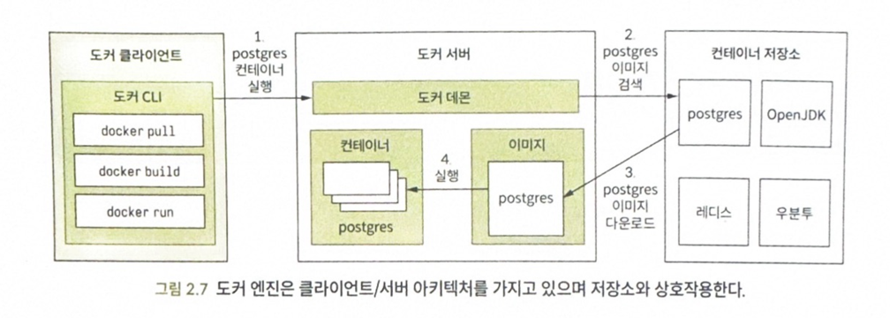

# 2. 클라우드 네이티브 패턴 및 기술
> **이 장의 주요 내용**
> - 클라우드 네이티브 애플리케이션을 위한 개발 원리의 이해
> - 스프링 부트를 사용한 클라우드 네이티브 애플리케이션 개발
> - 도커와 빌드팩을 사용한 애플리케이션 컨테이너화
> - 쿠버네티스로 애플리케이션을 클라우드로 배포
> - 책에서 사용하는 패턴 & 기술 소개

- 클라우드 네이티브 애플리케이션을 개발하려면 **우수 사례**와 **개발 패턴**으로 구성된 **12요소 방법론**에서 출발하면 좋다.
- 간단한 스프링 부트 애플리케이션 실습
  - `코드베이스` => `자바` => `도커` => `쿠버네티스` 

## 2.1 클라우드 네이티브 개발 원칙 : 12요소와 확장
- 히로쿠 클라우드 플랫폼 엔지니어 => **클라우드 네이티브 개발원칙 12요소 제안**
- 클라우드 네이티브 어플리케이션 모범사례 제시
  - 클라우드 플랫폼에 **배포하기에 적합**
  - **확장**을 염두에 둔 설계
  - 다양한 시스템에 적용 가능
  - 지속적 배포 및 **민첩성 지원**

- 케빈 호프만(Beyond the Twelve-Factor App) 에서 `세 가지 요소를 새로 추가`했다.
  - 따라서, 확장된 요소를 포함하여 **15요소 방법론**(15-Factor methodoloy)로 이야기한다.

### 2.1.1 하나의 코드베이스, 하나의 애플리케이션
- **각각의 애플리케이션**은 **각각 코드베이스**를 갖는다.
- `공유코드`는 별도의 코드베이스로 유지, 의존성 라이브러리 및 **독자적으로 실행할 수 있는 서비스**
  - **다른 애플리케이션을 지원**
- `배포`는 애플리케이션의 실행 인스턴스다.
  - 각 환경에서 실행되는 **애플리케이션 아티팩트는 모두 동일**하다. => 
  - 특정 환경 배포위해 다시 빌드할 필요가 없다.
  - 배포 사이의 상이한 측면(`설정`)은 **애플리케이션 코드베이스 외부**에 있어야 한다.

### 2.1.2 API 우선
- 네이티브 애플리케이션을 설계시, API 우선(API first) 접근 방식을 사용하라.
- API를 먼저 설계 => `다른 팀`은 해당 API를 가지고 **자신들의 시스템을 개발**
- `코드 계약을 미리 설계`하면 **다른 시스템과 통합은 더욱 견고**해지며, **배포 파이파라인에서 테스트가 용이**해진다.
  - 내부적으로 다른 애플리케이션에 영향을 미치지 않고 API 구현을 변경할 수 있다.

### 2.1.3 의존성 관리 
- `애플리케이션의 의존 라이브러리`는 **명시적인 방식으로 선언**되어야 한다.
  - 자바진영, 메이븐&그래들

### 2.1.4 설계, 빌드, 릴리스, 실행
- 코드베이스는 설계 ~ 프로덕션 배포까지 다양한 단계를 거친다.
  - `설계 단계`
    - 어플리케이션에 필요한 기술/의존성/툴 결정
  - `빌드 단계`
    - 코드베이스 및 의존 라이브러리 패키지, **불가변 아티팩트를 생성** => **빌드 아티팩트는 고유하게 식별할 수 있어야 한다.**
  - `릴리스 단계`
    - `배포`하기 위해 **빌드를 특정 설정과 결합**
      - 시맨틱 버저닝, 타임스탬프등을 활용하여 고유하게 식별
  - `실행 단계`
    - 애플리케이션 **특정 릴리스**가 **실행 환경에서 작동**한다.

### 2.1.5 설정, 크리덴셜 및 코드
- **설정** 이란? 
  - 15요소 방법론에서 이란 배포 사이에 변경될 가능성이 있는 모든 것 이라고 말한다.
- **설정의 변경**은 **코드의 변경이나 애플리케이션 재빌드 없이** 할 수 있어야 한다.
- 어떤 유형의 설정이라도 **별도의 저장소로 관리**해야 한다.

### 2.1.6 로그
- 로그 저장 및 순환에 대해서는 **애플리케이션이 신경 쓰지 말아야 한다.**
- **로그 수집기**같은 외부 툴을 사용해 로그를 수집하고 검사할 수 있다.

### 2.1.7 일회성
- 전통적인 환경에서는 애플리케이션이 계속 작동하도록 많은 노력을 기울였다.
- `클라우드 환경`에서는 더 이상 신경 쓰지 않아도 된다.
  - 애플리케이션은 삭제될 수 있다.
  - 실패가 발생하고 응답하지 않으면 종료하고 새 인스턴스를 시작하면 된다.
  - 부하가 많아지면 인스턴스를 늘린다.
- 언제라도 시작 및 중지할 수 있는 애플리케이션을 `일회성 애플리케이션이다` 라고 한다.
- **우아한 종료(gracefult shut down)** : 진행중인 요청을 모두 완료한 다음 종료하는 것.
  - 웹 프로세스에서는 간단하지만, 그렇지 않은 경우도 있다.(워커 프로세스는 작업을 작업큐로 반환해야 한다.)
### 2.1.8 지원 서비스
- **지원 서비스(backing servie)는** 자신의 기능을 제공하기 위해 외부 리소스로 정의할 수 있다.
  - 탈착식 리소스처럼 처리하면 코드를 수정하지 않고 리소스를 쉽게 변경할 수 있다.

### 2.1.9 환경 동일성
- **환경 동일성(environment parity)은** 모든 환경을 가능한 한 비슷하게 유지하는 것
- 환경 동일성을이 다른 경우는 3가지 정도로 존재한다.

- **시간 차이(time gap)**
  - 코드 수정 후, 배포까지의 기간은 클 수 있다.
  - 코드를 작성한 이후부터 프로덕션에 배포할 때까지의 기간을 줄이기 위해 노력한다.
- **사람 차이(people gap)**
  - 개발자는 애플리케이션을 만들고 운영자는 프로덕션에서 배포를 관리한다.
  - 이 격차는 데브옵스 문화를 수용해 개발자와 운영자간 협력을 증진하고 `만든 사람이 실행한다`는 철학을 실현함으로써 해결
- **도구 차이(tool gap)**
  - 지원 서비스를 처리하는 방법
  - local h2 db, 실 서비스 postgresql

### 2.1.10 관리 프로세스
- 애플리케이션 관리 작업은 **코드의 형태로 형상 관리 시스템을 통해 관리**하며, **동일한 환경에서 실행**해야 한다.

### 2.1.11 포트 바인딩
- 15요소 방법론을 따르는 애플리케이션은 **독립적**이며 **포트 바인딩**(port binding)을 통해 서비스를 제공해야 한다.
- 클라우드 네이티브 애플리케이션은 톰캣 서버를 제공하며, 자체적으로 의존성을 관리한다.
  - 예를들어, 스프링 부트는 톰캣이 임베디드 형태로 제공 된다.

### 2.1.12 상태를 갖지 않는 프로세스
- 확장성을 보장하기 위해 **상태를 갖지 않는 프로세스**가 되도록 `설계`해야한다.
- 또한, **아무것도 공유하지 않는 아키텍처**를 `채택`해야 한다.
- **상태를 갖지 않는 애플리케이션**은 `상태 관리 및 저장`을 `지원 서비스에 위임`한다.

### 2.1.13 동시성
- 애플리케이션은 **동시성(concurrency)를** 통해 많은 사용자에게 서비스를 제공할 수 있어야 한다.

### 2.1.14 원격 측정
- `관측 가능성`은 클라우드 네이티브 속성 중 하나다.
- 분산 시스템을 관리하기 복잡한데, 관리할 수 있는 유일한 방법은 **시스템의 작동을 원격으로 모니터링** 하는 것이다.
  - `원격 측정(telemetry)` 데이터는 **로그**, **메트릭**, **추적**, **상태**, **이벤트** 가 있다.

### 2.1.15 인증 및 승인
- 보안은 소프트웨어에서 필수적인 특성이지만, 주목을 받지 못하는 경우가 많다.
- **제로 트러스트**접근법에 따라 시스템 내 상호작용 안전성이 `설계적`, `인프라 수준`에서도 확보되어야 한다.
- 인증을 통해 누가 애플리케잉션을 사용하고 있는지 추적할 수 있다.
  - ID 및 액세스 관리의 구현을 위한 표준이 몇 가지 있다.
  - 이책에서는 `Oauth 2.0` 및 `오픈ID 커넥트(OpenID Connect, OIDC)`를 사용한다.

## 2.2 스프링을 사용한 클라우드 네이티브 애플리케이션 구축
- 스프링 생태계는 클라우드 네이티브 애플리케이션을 만들 수 있는 기능을 제공한다.

### 2.2.1 스프링 개요
- **스프링 프레임워크**
  - 모듈식 설계로 필요한 프로젝트만 사용하고 이들을 결합할 수 있다.
  - 실행 콘텍스트를 제공(스프링 컨텍스트, 스프링 컨테이너)하며, 빈(bean) 및 리소스가 전체 라이프 사이클에 걸쳐 관리된다.
- **스프링 부트**
  - 스프링 프레임워크 기반
### 2.2.2 스프링 부트 애플리케이션 구축
- 실습 : 폴라소피아의 폴라 북숍 애플리케이션 구축
- **C4 모델** : 은 소프트웨어 시스템의 아키텍처를 모델링하기 위한 간결한 그래픽 표기법

#### [프로젝트 초기화]
- 스프링 이니셜라이저
- 스프링 이니셜라이저 구성 선택사항
  - 프로젝트 => 메이븐, 그래들
  - 언어 => 자바, 코틀린, 그루비
  - 스프링부트 버전
  - `그룹` => 메이븐 저장소에서 사용하는 프로젝트 **그룹 ID**
  - `아티팩트` => 메이븐 저장소에서 사용하는 **아티팩트 ID**
  - `이름` => 프로젝트 이름
  - 패키지 이름 => 프로젝트의 기본 자바 패키지
  - `패키징` => **WAR**(애플리케이션 서버에 배포), **JAR**(독자적 애플리케이션)
  - 자바 => 사용할 자바 버전
  - 의존 모듈 => 프로젝트에 포함할 의존 모듈/라이브러리

> **그래들 또는 메이븐?**
> - 메이븐보다 그래들을 선호한다.
> - 그래들이 병렬적인 빌드 및 캐싱 시스템을 사용하기 때문이다.
> - 그래들 빌드 언어(DSL)가 메이븐보다 **읽기 쉽고 표현력이 뛰어나며 유지 관리가 쉽다.**

#### [빌드 설정]
````groovy
//build.gradle
plugins {
	id 'org.springframework.boot' version '2.7.18'
	id 'io.spring.dependency-management' version '1.0.15.RELEASE'
	id 'java'
}

group = 'com.polarbookshop' //카탈로그 서비스 프로젝트의 그룹 ID
version = '0.0.1-SNAPSHOT'	// 애플리케이션의 버전
sourceCompatibility = '17' //프로젝트 빌드시 사용할 버전

description = 'Provides functionality for managing the books in the catalog.'

repositories { // 의존 라이브러리를 검색할 아티팩트 저장소
	mavenCentral()
}

dependencies {
	implementation 'org.springframework.boot:spring-boot-starter-web' //웹관련 라이브러리
	testImplementation 'org.springframework.boot:spring-boot-starter-test' //junit, mokito, assert 포함
}

tasks.named('test') {
	useJUnitPlatform()	//Junit5가 제공하는 Junit 플랫폼으로 테스트하도록 설정
}

//settings.gradle
rootProject.name = 'catalog-service'    //프로젝트의 이름!
````
#### [애플리케이션 부트스트랩]
- @SpringBootApplication 어노테이션은 아래 세 가지 어노테이션을 포함한다.
  - @Configuration
    - 해당 클래스가 빈을 정의하는 클래스임을 나타낸다. 
  - @ComponentScan
    - 해당 어노테이션을 사용하면 **컴포넌트 검색을 통해 빈을 찾가 스프링 콘텍스트에 자동으로 등록**한다.
  - @EnableAutoConfiguration
    - 스프링 부트에서 제공하는 **자동 설정 기능을 활성화 한다.**
#### [컨트롤러 구현]
- @RestController
  - REST/HTTP 엔드포인트를 위한 핸들러를 정의하는 클래스로 인식
- @GetMapping
  - get 요청을 처리
#### [애플리케이션 테스트]
- @SpringBootTest 
  - **스프링부트 애플리케이션을 테스트하기 위한 셋업 제공**
- @Test
  - 테스트 케이스를 식별

````shell
# 테스트 진행!
./gradlew test
````

````shell
# 스프링 부트 실행
./gradlew bootRun
````

## Useful Commands

| Gradle Command	         | Description                                   |
|:---------------------------|:----------------------------------------------|
| `./gradlew bootRun`        | Run the application.                          |
| `./gradlew build`          | Build the application.                        |
| `./gradlew test`           | Run tests.                                    |
| `./gradlew bootJar`        | Package the application as a JAR.             |
| `./gradlew bootBuildImage` | Package the application as a container image. |


After building the application, you can also run it from the Java CLI:
```bash
java -jar build/libs/catalog-service-0.0.1-SNAPSHOT.jar
```
#### [애플리케이션 실행]


## 2.3 도커를 통한 애플리케이션 컨테이너화
- 애플리케이션을 컨테이너로 만들어야 하는데 왜 그럴까?
  - 컨테이너를 사용하면 `주변 환경과의 격리가 가능`하다.
  - 애플리케이션이 실행할 때 `사용하는 모든 것이 컨테이너 안에 준비`된다.
  - `의존성`은 **그래들에 의해 관리**된다.
- 애플리케이션을 컨테이너화 하는것이 의미하는 것!
  - 어떤 종류의 클라우드 환경이라도 `애플리케이션`이 **독립적**이고 **이식 가능하다**는 것을 의미한다.
- 리눅스 재단의 프로젝트인 **오픈 컨테이너 이니셔티브(Open Container Initative, OCI)는** **컨테이너 작업을 위한 업계 표준을 정의**한다.
  - OCI 이미지 사양 => 컨테이너 이미지 `빌드 방법` 정의
  - OCI 런타임 사양 => 컨테이너 이미지 `실행 방법` 정의
  - OCI 배포 사양 => 컨테이너 이미지 `배포 방법` 정의
- 우리는 OCI 사양을 준수하는 **도커**를 사용한다.
- `도커`(오픈소스)는 애플리케이션을 패키징 및 실행할 수 있는 기능을 제공한다.

### 2.3.1 도커소개 : 이미지 및 컨테이너
- **도커 서버**에는 **도커 데몬이 포함**되어 있다.
- **도커 데몬**은 백그라운드에서 **이미지, 컨테이너, 볼륨, 네트워크 같은 도커 객체를 만들고 관리**한다.
- **도커 호스트** 란 `도커 서버가 실행되는 컴퓨터`를 말한다.
- **도커 클라이언트**를 통해 `도커 데몬`은 API를 제공한다(컨테이너 실행, 볼륨 생성 등)
  - `도커 클라이언트`는 **명령어 기반**이며, 도커 컴포즈와 같은 **스크립트 방식 사용**
  - 또한, 도커 명령어 인터페이스를 통해 도커 데몬과 상호작용하면서 명령을 전달한다.
- **도커 컨테이너 저장소**가 있는데 메이븐 저장소와 비슷한 기능을 갖는다.
  - 컨테이너 이미지에 대해 동일한 일을 수행하고 OCI 배포 사양을 따른다.
  - `컨테이너 저장소`는 **공용 저장소**와 **사설 저장소**로 구분된다.
- **컨테이너 이미지**는 내부에서 애플리케이션을 실행하는 데 필요한 모든것을 포함하는 **실행 가능한 경량 패키지**
  - 그 중 **도커 이미지 형식**은 컨테이너 이미지를 만드는 데 `가장 많이 사용`된다.
  - OCI 이미지는 Dockerfile에서 명령을 정의하여 원하는 이미지를 만들 수 있다.
- **컨테이너**는 `컨테이너 이미지의 실행 가능한 인스턴스`다.
  - 도커 CLI, 도커 컴포즈를 통해 **컨테이너의 라이프사이클을 관리할 수 있다.**
  - **포트 포워딩이**나 **포트매핑**을 할 수 있다.


#### 도커
  
출처 : 클라우드 네이티브 스프링 인 액션  


#### [도커 명령어]
|    Docker Command	    |             Description              |
|:---------------------:|:------------------------------------:|
|    `docker images`    |              이미지를 보여준다.           |
|      `docker ps`      |           실행중인 컨테이너를 보여준다.      |
|    `docker ps- a`     |    생성되거나 시작되거나 중지된 컨테이너를 모두 보여준다.    |
| `docker run <image>`  |       지정된 이미지를 가지고 컨테이너를 실행한다.       |
| `docker start <name>` |            기존 컨테이너를 시작한다.            |
| `docker stop <name>`  |          실행 중인 컨테이너를 중지한다.           |
| `docker logs <name>`  |        지정된 컨테이너로부터 로그를 출력한다.         |
|  `docker rm <name>`   |           중지된 컨테이너를 삭제한다.            |
|  `docker rm <image>`  |              이미지를 삭제한다.              |

### 2.3.2 컨테이너를 통한 스프링 애플리케이션의 실행
````shell
#컨테이너 이미지 패키징
./gradlew bootBuildImage

#이미지 확인
docker images 
````

#### Container tasks
= Run Catalog Service as a container
```bash
docker run --rm --name catalog-service -p 8080:8080 catalog-service:0.0.1-SNAPSHOT
# docker run => 이미지에서 컨테이너를 실행한다. 
# --rm => 실행종료 후 컨테이너를 삭제한다.
# --name catalog-service => 컨테이너의 이름
# -p 8080:8080 => 8080포트를 통해 컨테이너 외부로 서비스를 노출한다.
# catalog-service:0.0.1-SNAPSHOT => 실행할 이미지의 이름과 버전
```

## 2.4 쿠버네티스로 컨테이너 관리
- **쿠버네티스**(k8s)는 컨테이너 애플리케이션의 `배포`, `확장` , `관리`를 **자동화**하기 위한 **오픈소스 시스템**이다.
- **k8s**는 여러 머신으로 구성된 클러스터로 배포시, 우리를 대신해서 클러스터를 관리해준다.
- 컨테이너의 배포대상은 한대의 머신이지만, **오케스트레이터의 경우 클러스터**다.
  ````
  컨에이너 구성
  <컨테이너> -- 배포 --> vm
  
  오케스트레이션 구성
  <컨테이너> -- 배포 --> vm vm
                     vm vm
  ````


### 2.4.1 쿠버네티스 소개 : 배포, 파드, 서비스
- **쿠버네티스**는 CNCF가 관리하는 오픈소스 컨테이너 오케스트레이터다.
  - **컨테이너 오케스트레이션에서 표준으로 자리잡고 있다.**
- `k8s 클러스터`란?
  - **컨테이너화된 애플리케이션을 실행하는 작업 머신의 집합**이다.
  - **각 작업자 머신**을 `노드` 라고 한다.
- `k8s 클러스터`에는 **작업자 노드(worker node)라고** 부르는 머신이 여러대 존재할 수 있다.
  - 이 작업자 노드에 **컨테이너화된 애플리케이션이 배포**된다.
  - 컨테이너가 실행하고 네트워크에 연결할 수 있도록 `작업자 노드`는 **CPU, 메모리, 네트워크, 스토리지 등을 제공**한다.
- **컨트롤 플레인(control plane)은** 작업자 노드를 관리하는 **컨테이너 오케스트레이션 계층**이다.
  - 컨테이너 라이프사이클 정의, 배포, 관리 한다.
  - 클러스터 관리, 스케줄링, 상태 모니터링을 진행 한다.
- 클라이언트인 **kubectl**을 통해 쿠버네티스와 상호작용이 이루어 진다.
- **kubectl**은 `컨트롤 플레인과의 통신을 통해 작업자 노드에서 작업을 수행`한다.
  - `클라이언트`는 **작업자 노드와 직접 연결 하지 않는다.**

#### [k8s 주요 구성 요소]
  ````
  쿠버네티스 클라이언트          
  - k8s CLI          ===>  k8s 컨트롤 플레인 ===>                   K8s 작업자 노드 
   > kubectl create                               파드(instnce)   파드(instnce)   파드(instnce)
   > kubectl get
   > kubectl delete 
  ````
  
출처 : https://www.youtube.com/watch?app=desktop&v=TlHvYWVUZyc
- **파드(pod)**
  - **가장 작은 배포 단위**로 `하나 이상의 컨테이너를 포함`할 수 있다.
  - 일반적으로 하나의 파드에는 애플리케이션이 하나만 있다.
  - **k8s**는 컨테이너를 직접관리하지 않고 `파드를 관리`한다.
- **배포(deployment)**
  - `배포 객체를 통해` 애플리케이션에 대해 **원하는 배포 상태를 쿠버네티스에 알린다.**
  - 배포를 통해 `여러개의 파드`를 **하나의 집합체로 관리**하는 것이 가능하다.
- **서비스(service)**
  - `서비스 정의`를 통해 배포(파드의 집합)은 클러스터 내의 **다른 노드나 외부로 노출**된다.
- k8s 객체에 대해, **리소스 매니페스트(resource manifest)** 를 정의할 수 있다.
  - 이것은 **애플리케이션에 대해 원하는 상태를 기술하는 파일**이다.
  - ex) 5개를 복제해서 8080 포트를 통해 외부로 노출되어야 한다를 명시
  - **yaml** 파일을 사용해 작성된다.
  - kubectl 클라이언트를 사용 => `컨트롤플레인`에게 **manifest 명세대로 리소스를 생성하도록 요청**한다.
  - `컨트롤플레인` => manifest 명세된 이미지를 가져오기 위해 **컨테이너 저장소를 사용**

### 2.4.2 쿠버네티스에서 스프링 애플리케이션 실행
- 이제 쿠버네티스를 사용해 클러스터에 배포할 때가 왔다!
- 이미 로컬 환경에서 클러스터가 실행되고 있고, 필요한 것은 **리소스 매니페스트 파일**이다.
  - yaml 또는 json 파일에 선언적 명령어를 정의하는 것이다(7장에서 배울예정)
- 첫째로, `컨테이너 이미지`로 카탈로그 서비스를 배포하도록 **쿠버네티스에 명령**해야 한다.
````bash
# 도커 허브 레지스트리에서 이미지를 가져오는게 default,
# 어쩔수 없이, 해당 이미지는 수동작업으로 로컬 클러스터로 로드시켜야한다.
# 로드 명령어 
minikube image load catalog-service:0.0.1-SNAPSHOT 
````

## Kubernetes tasks

### Create Deployment for application container

```bash
# kubectl create : 쿠버네티스 리소스 생성
# deployment : 생성할 리소스 유형
# catalog-service : 배포 이름
# --image=catalog-service:0.0.1-SNAPSHOT : 실행할 이미지의 이름과 버전
kubectl create deployment catalog-service --image=catalog-service:0.0.1-SNAPSHOT
```
- `kubectl get deployment`
  - 배포 객체가 잘 생성됐는지 확인
    
- `kubectl get pod`
  - 배포 생성 명령을 실행시, **내부적으로 배포 리소스에 정의된 애플리케이션용 파드가 만들어진다.**
    

### Create Service for application Deployment

```bash
# kubectl expose : 쿠버네티스 리소스를 노출한다.
# deployment : 노출할 리소스의 유형
# catalog-service : 노출할 배포의 이름
# --name=catalog-service : 서비스 이름 
# --port=8080 : 서비스를 노출할 포트 번호
kubectl expose deployment catalog-service --name=catalog-service --port=8080
```
- `kubectl get service catalog-service`
  - 서비스가 잘 생성됐는지 확인
      

### Port forwarding from localhost to Kubernetes cluster

```bash
# kubectl port-forward : 포트 포워딩 명령
# service/catalog-service : 노출할 리소스
# 8000 => 로컬 호스트의 포트 
# :8080 => 서비스 포트
kubectl port-forward service/catalog-service 8000:8080
```
- 포트포워딩 확인
    

- 쿠버네티스를 사용해 애플리케이션을 클러스터에 배포 완료!
  

### Delete Deployment for application container

```bash
kubectl delete deployment catalog-service
```

### Delete Service for application container

```bash
kubectl delete service catalog-service
```

#### [k8s 명령어]
|                           k8s CLI 명령	                           |          Description         |
|:---------------------------------------------------------------:|:----------------------------:|
|                    `kubectl get deployments`                    |        모든 배포 객체를 보여준다.       |
|                        `kubectl get pod`                        |         모든 파드를 보여준다.         |
|                        `kubectl get svc`                        |         모든 서비스를 보여준다.        |
|                     `kubectl logs <pod_id>`                     |       지정한 파드의 로그를 보여준다.      |
|               `kubectl delete deployment <name>`                |       지정한 배포 객체를 삭제한다.       |
|                   `kubectl delete pod <name>`                   |         지정한 파드를 삭제한다.        |
|                 `kubectl delete svc <service>`                  |        지정한 서비스를 삭제한다.        |
| `kubectl port-forward svc <service> <host-port>:<cluster:port>` | 자신의 로컬 컴퓨터에서 클러스터로 트래픽을 보낸다. |

#### [minikube]
|                k8s CLI 명령	                 |            Description             |
|:------------------------------------------:|:----------------------------------:|
|              `minikube start`              |                 시작                 |
|     `minikube image ls --format table`     |     minikube 에서 이용 가능한 이미지 조회      |
| `minikube image load [imageName:tagName]`  |       minikube 에 이미지 push 하기       |


## 2.5 폴라 북숍 : 클라우드 네이티브 애플리케이션
- 구현에 사용할 주요 기술과 패턴을 살펴볼 것이다.
### 2.5.1 시스템 요구 사항 이해
- 확장성 & 복원력 필수적이다.
### 2.5.2 프로젝트에서 사용되는 패턴과 기술
#### 1. 웹과 상호작용
- 동기식 HTTP통신, 넌블로킹 방식(리액티브 프로그래밍)으로 구축
  - 스프링 MVC, spring webflux
- 동기식 통신은 하나의 기능을 수행하기위해 연관된 서비스가 많을수록 문제를 일으킨다.
  - **이벤트 기반 프로그래밍**을 통해 이를 해결할 수 있다.
- `스프링 클라우드 스트림`(Spring cloud stream)를 통해 서비스간 데이터 흐름을 구현.
- `스프링 클라우드 함수`(Spring cloud function)을 사용해 메시지 처리를 위한 함수 정의.

#### 2. 데이터
- 스프링 데이터 **JDBC**, **R2DBC**를 활용 예정
- `레디스`를 통해 **세션 데이터를 외부 데이터 저장소에 저장** => **상태를 갖지 않고 확장 가능**
  - **스프링 세션**(Spring Session)을 사용
  - 특히, **스프링 세션 데이터 레디스(Spring Session Data Redis)를** 활용할 예정이다.

#### 3. 설정
- **스프링 클라우드 컨피그(Spring Cloud Config)를** 통해 `설정관리`를 `중앙 집중화`
- k8s `컨피그맵`, `시크릿` 사용법 배울 예정

#### 4. 라우팅
- 북숍은 분산 시스템이기 때문에 **라우팅(routing)설정**이 필요하다.
- k8s는 **서비스 디스커버리 기능이 내장**되어 있어, 이를 통해 **서비스는** 물리적 주소나 호스트 이름과는 독립적으로 존재할 수 있다.
- **스프링 클라우드 게이트웨이**(Spring Cloud Gateway)를 이용해 API게이트웨이 서비스를 구현할 것이다.
  - `보안`, `복원력`, `공통`으로 발생하는 이슈를 처리하는 **에지 서비스**
  - 폴라 북숍의 진입점이 되므로 **고가용성**, **고성능**, **내구성**을 갖춰야 한다.

#### 5. 관측 가능성
- 클라우드 네이티브 조건을 만족하려면 **관측 가능성(observability)를 제공**해야 한다.
  - `spring boot Actuator 를 통해 health, 정보 설정` => `마이크로미터(Micrometer)에 측정값 제공` => `프로메테우스가 처리` => `그라파냐 시각화`
  - 하나 이상의 서비스에서 처리될 수 있어, **분산 추적**이 필요하다. => `오픈텔레메트리`를 통해 설정 => `그라파냐 템포`를 통해 **트레이스 데이터를 가져와 처리 및 시각화**
  - 로그 전략
    - `플루언트 비트(Fluent Bit)를 통해 로그를 수집` => `로키(loki)를 사용해 로그를 저장 및 처리` => `그라파냐 로그 검색 처리`

#### 6. 복원력
- 클라우드 네이티브 애플리케이션은 **복원력(resilience)가** 필요하다.
  - 리액터, 서킷브레이커, 재시도, 타임아웃, 기타패턴 구현

#### 7. 보안
- **인증 및 권한 부여 기능을 추가하는 방법을 보여줄 것이다.**
- `OAuth 2.1` 및 `오픈아이디 커넥트`
  - 스프링 시큐리티는 이들 표준을 지원한다.
  - `키클록(Keycloak)`을 사용해 신원 및 액세스 제어를 수행할 것이다.

#### 8. 테스트
- Junit5를 사용해 단위 테스트 작성 방법을 살펴본다.
  - `REST 엔드포인트`, `메시징 스트림`, `데이터 통합` 및 `보안`을 포함한 테스트

#### 9. 빌드 및 배포
- 스프링 네이티브(Spring Native) 및 그랄VM(GraalVM)을 사용해 이미지로 컴파일 => 서버리스 아키텍처 경험
- 그 이후, k8s에 케이네이티브를 사용해 배포할 예정이다.
- 깃허브 액션(Github Actions)를 통해 빌드 파이프라인 자동화
  - 매번 커밋시 빌드 및 테스트, 배포 가능한 패키지 생성
  - 깃옵스, 아르고 CD를 사용해 k8s 클러스터에 배포를 자동화

#### 10. UI
- 앵귤러 프레임워크 사용

## 요약

