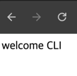
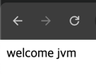
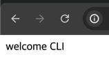
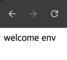
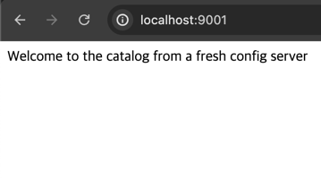

# 4. 외부화 설정 관리
> **이 장의 주요 내용**
> - 속성과 프로파일을 사용한 스프링 설정
> - 스프링 부트로 외부 설정 적용 
> - 스프링 클라우드 컨피그 서버로 설정 서버 구현
> - 스프링 클라우드 컨피그 클라이언트를 사용한 애플리케이션 설정

- `설정`은 15요소 방법론에 의하면 배포 간 변경될 수 있는 모든 것으로 정의된다.
  - `크리덴셜`, `리소스 핸들`, `지원 서비스 URL` 등이다.
- `클라우드 네이티브 애플리케이션의 핵심` 중 하나는 환경이 달라지더라도 `애플리케이션 아티팩트는 동일`하다.
  - 동일한 빌드가, 동일하지 않은 설정 데이터와 함께 여러 환경에 배포된다.(그림 4.1)
- `클라우드 네이티브 애플리케이션`은 코드를 재빌드하지 않고도 교체할 수 있도록 **외부화된 설정을 선호**한다.

## 4.1 스프링 설정 : 속성과 프로파일
- 스프링에서는 `Environment`라는 편리한 추상화 기능을 통해, **모든 설정 데이터에 액세스**할 수 있다.

### 4.1.1 속성 : 설정을 위한 키-값 쌍
#### 애플리케이션 속성의 사용
````java
@Autowired
private Environment environment;

public String getServerPort(){
    return environment.getProperty("server.port");    
}

@Value("${server.port}")
private String serverPort;

public String getServerPort(){
    return serverPort;    
}
````
- 스프링 애플리케이션 속성에 액세스하는 방법
  - Environment 인터페이스를 통해 속성에 접근
  - @Value 애너테이션 주입
  - @ConfigurationProperties
#### 사용자 지정 속성 정의
````java
@SpringBootApplication
@ConfigurationPropertiesScan
public class CatalogServiceApplication {

	public static void main(String[] args) {
		SpringApplication.run(CatalogServiceApplication.class, args);
	}

}

@ConfigurationProperties(prefix = "polar")
public class PolarProperties {
  private String greeting;

  public String getGreeting() {
    return greeting;
  }
}
````
````shell
configurations {
	compileOnly {
		extendsFrom annotationProcessor
	}
}
dependencies {
  ...
  annotationProcessor "org.springframework.boot:spring-boot-configuration-processor"
  ...
}
````
#### 사용자 지정 속성 사용
````java
@RestController
public class HomeController {

	private final PolarProperties polarProperties;

	public HomeController(PolarProperties polarProperties) {
		this.polarProperties = polarProperties;
	}

	@GetMapping("/")
	public String getGreeting() {
		return polarProperties.getGreeting();
	}

}
````

### 4.1.2 프로파일 : 기능 플래그와 설정 그룹
#### 프로파일을 기능 플래그로 사용
````java
@Component
@Profile("testdata")
public class BookDataLoader {
	private final BookRepository bookRepository;
	public BookDataLoader(BookRepository bookRepository) {
		this.bookRepository = bookRepository;
	}
	@EventListener(ApplicationReadyEvent.class)
	public void loadBookTestData() {
		var book1 = new Book("1234567891", "Northern Lights", "Lyra Silverstar", 9.90);
		var book2 = new Book("1234567892", "Polar Journey", "Iorek Polarson", 12.90);
		bookRepository.save(book1);
		bookRepository.save(book2);
	}
}
````
````shell
bootRun {
  systemProperty 'spring.profiles.active', 'testdata'
}
````

#### 프로파일을 설정 그룹으로 사용
- application-dev.yml 등

## 4.2 외부화된 구성 : 하나의 빌드, 여러 설정
- 애플리케이셔ㅕㄴ을 빌드해서 패키지를 만든 후에 더 이상 변경하지 않는다는 것이다.
  - 설정 변경이 필요한 경우 **외부에서 이루어 진다.**
````
polar.greeting 속성값
왼쪽이 우선순위가 제일 높임
CLI => JVM => 환경 변수 => 속성 파일
````
### 4.2.1 커맨드라인 인수를 통한 애플리케이션 설정
````shell
java -jar build/libs/catalog-service-0.0.1-SNAPSHOT.jar --polar.greeting="welcome CLI"
````

### 4.2.2 JVM 시스템 속성을 통해 애플리케이션 구성
````shell
java -Dpolar.greeting="welcome jvm" -jar build/libs/catalog-service-0.0.1-SNAPSHOT.jar
````


````shell
# cli 가 우선순위가 높다.
java -Dpolar.greeting="welcome jvm" -jar build/libs/catalog-service-0.0.1-SNAPSHOT.jar --polar.greeting="welcome CLI"
````


### 4.2.3 환경 변수를 통해 애플리케이션 구성
- POLAR_GREETING 은 polar.greeting 으로 정의된다.
````shell
POLAR_GREETING="welcome env" java -jar build/libs/catalog-service-0.0.1-SNAPSHOT.jar
````


## 4.3 스프링 클라우드 컨피그 서버로 중앙식 설정 관리하기
- 환경 변수를 사용하더라도 처리할 수 없는 문제가 있다.
  - 설정 데이터를 어디에 저장해야할까?
  - 설정 데이터에 대한 액세스를 어떻게 제어할 수 있을까?
  - 설정 데이터의 수정을 추적하고 릴리스에 사용된 설정을 감시해야할까?
  - 인스턴스가 여러개가 되면 분산설정을 어떤식으로 처리해야 할까?
- 스프링 생태계는 이러한 문제를 다룰수 있는 다양한 방법이 있다. 총 3가지 유형으로 분류된다.
  - `설정 서비스`
    - 스프링 클라우드 콘술 & 하시코프 콘술
    - 스프링 클라우드 볼트 & 하시코프 볼트
    - 스프링 클라우드 컨피그 & 깃 & 하시코프 볼트
    - 스프링 클라우드 주키퍼 & 아파치 주키퍼
  - `클라우드 공급업체 서비스`
    - 스프링 클라우드 aws + aws secret manager, aws parameter store
    - 스프링 클라우드 애저 + 키볼트
  - `클라우드 플랫폼 서비스`
    - 쿠버네티스 플랫폼에서 스프링 실행시 configmap 및 시크릿 사용

> 설정 서버를 사용할때 기본적으로 최소한 두 개의 복제본을 배포해야 한다.

### 4.3.1 깃을 통한 설정 데이터 저장
### 4.3.2 설정 서버 구성
#### 프로젝트 부트스트래핑
````shell
plugins {
    id 'org.springframework.boot' version '2.7.18'
    id 'io.spring.dependency-management' version '1.0.15.RELEASE'
    id 'java'
}

group = 'com.polarbookshop'
version = '0.0.1-SNAPSHOT'
sourceCompatibility = '17'

description = 'Provides functionality for centralizing the application configuration.'

repositories {
    mavenCentral()
}

ext {
    set('springCloudVersion', "2021.0.9") #버전
}

dependencies {
    implementation 'org.springframework.cloud:spring-cloud-config-server'
    testImplementation 'org.springframework.boot:spring-boot-starter-test'
}

dependencyManagement {
    imports {
        mavenBom "org.springframework.cloud:spring-cloud-dependencies:${springCloudVersion}" #스프링 클라우드 의존성 관리를 위한 BOM
    }
}
tasks.named('test') {
	useJUnitPlatform()
}
````
- 스프링 클라우드 컨피그 서버
  - org.springframework.cloud:spring-cloud-config-server
- 스프링 부트 테스트
  - org.springframework.boot:spring-boot-starter-test

#### 설정 서버 활성화
````java
@SpringBootApplication
@EnableConfigServer //설정 서버 활성화
public class ConfigServiceApplication {
	public static void main(String[] args) {
		SpringApplication.run(ConfigServiceApplication.class, args);
	}
}
````
#### 설정 서버 설정
````yaml
server:
  port: 8888
  tomcat:
    connection-timeout: 2s
    keep-alive-timeout: 15s
    threads:
      max: 50
      min-spare: 5

spring:
  application:
    name: config-service
  cloud:
    config:
      server:
        git:
          uri: https://github.com/PolarBookshop/config-repo #깃헙의 저장소를 가리킨다.
          default-label: main #서버는 main 브랜치에서 설정 데이터를 반환한다.
          timeout: 5 #원격 저장소와의 연결시 시간 한도
          clone-on-start: true #서비스 시작시 리모트 저장소의 복제본을 로컬에 저장
          force-pull: true #로컬 저장본이 원격과 다를경우 무조건 원격 저장소로부터 다운로드

````

### 4.3.3 복원력 높은 설정 서버 생성
- 컨피그 서비스는 시스템의 단일 장애 지점이 될 수 있다.
- 애플리케이션이 설정 서비스를 사용하면, 설정 서비스는 높은 가용성을 가져야 한다.
- `원격 저장소`와의 연결에 **너무 많은 시간을 기다리지 않도록 타임아웃을 정의**할 수 있다.
  - git.timeout (위 config 참조)
- 스프링 클라우드 컨피그는 설정 데이터를 최초로 가져온 후에 로컬에 복제한다.
  - git.clone-on-start => 저장소 복제가 서비스 시작시 이루어지도록 true 권장
- 로컬 복사본과 원격 저장소 설정이 달라질 수 있다.
  - git.force-pull 설정시, 원격과 달리진다면 로컬 복제본을 삭제하고 데이터를 새로 가져온다.
- 필요한경우 속성이 복제되는 위치를 지정할 수 있다.
  - git.basedir
### 4.3.4 설정 서버 REST API 이해
- 스프링 클라우드 컨피그 서버는 {application},{profile},{label} 의 서로 다른 조합을 사용한 엔드포인트를 통해 속성을 제공한다.

## 4.4 스프링 클라우드 컨피그 클라이언트로 설정 서버 사용
- 스프링 클라우드 컨피그 클라이언트를 사용해 카탈로그 서비스를 설정 서버와 통합하는 방법에 대해 설명한다.
- `새로운 변경사항`이 **설정 저장소로 푸시될 때마다 일어나는 상호작용**을 어떻게 하면 더욱 견고하게 할 수 있는지
- `클라이언트의 설정`을 **어떻게 갱신**할 수 있는지 살펴본다.

### 4.4.1 설정 클라이언트 구축
- `스프링 클라우드 클라이언트 의존성` catalog-service에 **새로 추가**
````shell
dependencyManagement {
	imports {
		mavenBom "org.springframework.cloud:spring-cloud-dependencies:${springCloudVersion}"
	}
}
````

### 4.4.2 내결함성이 높은 설정 클라이언트의 구축
- 설정 서버와 통합이 필수인 경우, 애플리케이션 설정 서버에 연결할 수 없다면 애플리케이션은 시작하지 못한다.
- 설정 서버가 작동하고 있더라도, 분산 환경에서 상호작용이 일어나기 때문에 문제가 발생할 수 있다.
  - 애플리케이션이 신속히 실패하도록 타임아웃을 정의하는 것이 좋다.
  - `spring.cloud.config.request-connect-timeout` 을 사용해 타임아웃을 제어할 수 있다.
    - 설정 서버에 **연결 될때 까지 기다리는 시간**
  - `spring.cloud.config.request-read-timeout` 을 사용하면 설정 데이터를 읽는 데 걸리는 시간을 제한할 수 있다.
    - 설정 서버에서 설정 **데이터를 읽을때까지 기다리는 시간**
- 설정 서버에 연결이 안 된다고 해서 실패 상태로 바로 가기 보다는 `재시도(retry) 패턴을 활용`해 설정 서버에 연결을 재시도하도록 설정할 수 있다.
- 카탈로그 서비스에 retry 추가
````shell
dependencies {
  ...
  implementation 'org.springframework.retry:spring-retry'
  ...
}
````
````yaml
server:
  port: 9001
  tomcat:
    connection-timeout: 2s
    keep-alive-timeout: 15s
    threads:
      max: 50
      min-spare: 5

spring:
  application:
    name: catalog-service #설정 서버가 올바른 설정 데이터를 반환하기 위해서는 애플리케이션 이름을 사용한다.
  config:
    import: "optional:configserver:" #설정 서버와의 상호작용을 선택적으로 만들 수 있다(config 서버가 꺼져있어도 애플리케이션은 켜진다.)
  cloud:
    config:
      uri: http://localhost:8888  #컨피그 서버 uri
      request-connect-timeout: 5000 # 5s, 설정 서버에 연결될때까지 기다리는 시간
      request-read-timeout: 5000 # 5s, 설정 서버에서 설정 데이터를 읽을때까지 기다리는 시간
      fail-fast: false # In production, set to true, 설저 서버 연결 실패를 치명적 오류로 인식
      retry:
        max-attempts: 6 # 시도 최대 횟수
        initial-interval: 1000 # 1s, 최초 재시도 지연 시간
        max-interval: 2000 # 2s, 재시도 지연 최대 시간
        multiplier: 1.1 # 지연 시간 계산 승수    
````

### 4.4.3 런타임 시 설정 새로고침
- 표준 스프링 부트 애플리케이션에서는 `속성을 변경`하고 `반영`하려면 **애플리케이션을 다시 시작**해야 한다.
- `스프링 클라우드 컨피그`는 클라이언트 애플리케이션에서 설정을 업데이트할 수 있는 다양한 방법을 제공한다.
  - 새로고침을 위한 **핫 리로드(hot reload)** 라는 간단한 방법을 살펴본다.
    => 카탈로그 서비스 인스턴스에 특수한 POST 요청을 보내 변경된 설정 데이터를 재로드하게 한다.

#### 설정 새로고침 활성화
- 카탈로그 서비스
````shell
dependencies {
	implementation 'org.springframework.boot:spring-boot-starter-actuator'
}
````
````yaml
management:
  endpoints:
    web:
      exposure:
        include: refresh
````

#### 런타임에 설정 변경

## 요약


